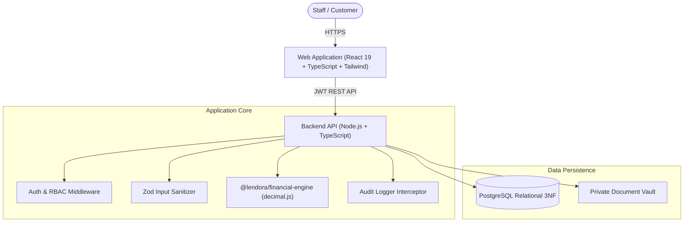

# Lendora FinTech Platform — Architecture & Technical Design

## 1. System Overview
Lendora is an enterprise-grade Loan Management & Customer Relationship Management (CRM) platform engineered for private lenders, microfinance institutions, and consumer credit providers.

## 2. Core Architectural Pillars

### 1. Arbitrary-Precision Financial Engine
- Eliminates standard JavaScript floating-point representation errors (`0.1 + 0.2 !== 0.3`).
- Uses `decimal.js` configured with 28-digit precision and Half-Up Banker's rounding.
- Pure zero-dependency package shared across API and Frontend client.

### 2. Immutable Financial Ledger & Audit Trail
- Transactions are append-only.
- Mistakes are corrected via compensating reversal transactions (`is_reversal = true`), maintaining complete auditability.
- Every state modification records actor ID, user email, action, entity, entity ID, previous JSON state, new JSON state, IP address, and timestamp.

### 3. Configurable Business & Legal Jurisdiction Rules
- Dynamic interest methods: Reducing Balance EMI, Flat Rate, Simple Interest, Compound Interest.
- Configurable payment allocation waterfall order (e.g. `Penalty -> Fees -> Interest -> Principal`).
- Configurable grace periods, late penalty schedules (daily %, one-time %, fixed), and early payoff terms.

---

## 3. User Roles & Access Control Matrix

| Capability / Module | Admin | Manager | Collection Agent | Accountant |
|---|:---:|:---:|:---:|:---:|
| **Portfolio Dashboard** | Full Access | Full Access | Assigned View | Financial View |
| **Customer CRM (Create/Edit)** | ✅ | ✅ | ❌ | ❌ |
| **Loan Creation Wizard** | ✅ | ✅ | ❌ | ❌ |
| **Loan Restructuring & Rescheduling** | ✅ | ✅ | ❌ | ❌ |
| **Prepayment / Foreclosure Settlement** | ✅ | ✅ | ❌ | ✅ |
| **Record Payment & Print Receipts** | ✅ | ✅ | ✅ | ✅ |
| **Payment Reversals** | ✅ | ❌ | ❌ | ❌ |
| **Collection Tasks & PTP Call Logs** | ✅ | ✅ | ✅ | ❌ |
| **Financial Reports (Export CSV)** | ✅ | ✅ | ❌ | ✅ |
| **Audit Log Inspector** | ✅ | ❌ | ❌ | ❌ |
| **Business & Legal Settings** | ✅ | ❌ | ❌ | ❌ |
