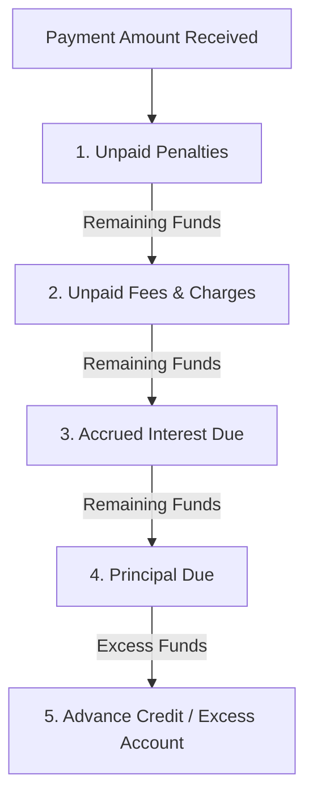

# Lendora FinTech Platform — Financial Calculation Engine Specifications

## 1. Floating-Point Arithmetic Policy
Under standard IEEE-754 floating point arithmetic in software, binary representation leads to floating-point drift:
```javascript
0.1 + 0.2 === 0.30000000000000004 // TRUE
```
In financial accounting, fractional-cent drift accumulates over thousands of installments and violates legal audit standards.

**Lendora Guarantee**:
All calculations in `@lendora/financial-engine` utilize `decimal.js` with 28 digits of intermediate precision and deterministic Half-Up Banker's rounding.

---

## 2. Interest Calculation Formulas

### A. Reducing Balance Equated Monthly Installment (EMI)
$$\text{EMI} = P \times \frac{r \times (1 + r)^n}{(1 + r)^n - 1}$$
Where:
- $P$ = Principal Disbursed
- $r$ = Periodic Interest Rate ($\frac{\text{Annual Rate}}{100 \times \text{Periods Per Year}}$)
- $n$ = Total Installments

#### Installment Breakdown Algorithm:
For installment $i \in [1, n]$:
1. $\text{Interest Due}_i = \text{Opening Principal}_i \times r$
2. $\text{Principal Due}_i = \text{EMI} - \text{Interest Due}_i$
3. $\text{Closing Principal}_i = \text{Opening Principal}_i - \text{Principal Due}_i$
4. **Zero-Residual Boundary Guarantee**: On final installment $n$, $\text{Principal Due}_n = \text{Opening Principal}_n$, strictly ensuring $\text{Closing Principal}_n = 0.00$.

### B. Flat Rate Interest
$$\text{Total Interest} = P \times \frac{\text{Annual Rate}}{100} \times \text{Years}$$
$$\text{Total Repayable} = P + \text{Total Interest}$$
$$\text{Installment Amount} = \frac{\text{Total Repayable}}{n}$$

### C. Simple Interest
$$\text{Interest} = \frac{P \times R \times T}{100}$$

### D. Compound Interest
$$\text{Maturity Amount} = P \times \left(1 + \frac{r}{m}\right)^{m \times t}$$

---

## 3. Payment Allocation Waterfall

When a payment amount $A$ is received, funds are distributed item-by-item according to the configured waterfall hierarchy:

### Default Hierarchy: `PENALTY_FEES_INTEREST_PRINCIPAL`


---

## 4. Late Penalty Accrual
$$\text{Chargeable Days} = \max(0, \text{Days Overdue} - \text{Grace Period Days})$$

- **Fixed Penalty**: Flat dollar fee applied once past grace period.
- **Percentage Penalty**: $\text{Overdue Amount} \times \frac{\text{Rate}}{100}$.
- **Daily Percentage Penalty**: $\text{Overdue Amount} \times \frac{\text{Rate}}{100} \times \text{Chargeable Days}$.

---

## 5. Early Prepayment & Foreclosure Settlement
$$\text{Settlement Amount} = \text{Outstanding Principal} + \text{Accrued Interest} + \text{Unpaid Penalties} + \text{Unpaid Fees} + \text{Prepayment Charge} - \text{Waiver Discount}$$
Upon full settlement, loan status transitions to `CLOSED` and all remaining amortization schedule items are marked `PAID`.
